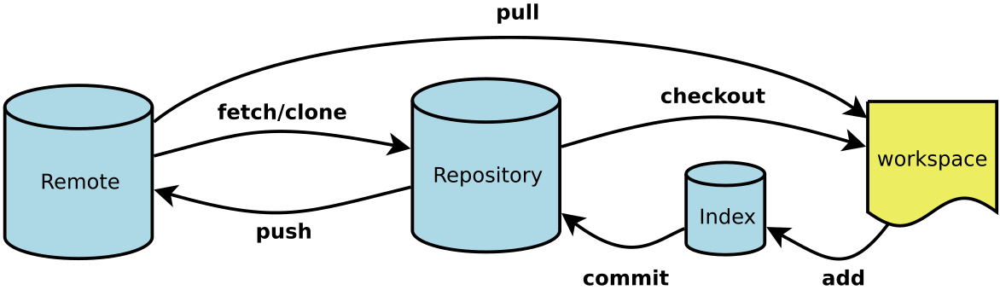

# git–工作区、暂存区、版本库、远程仓库

## 一、概念

### 1、四个工作区域

1. **Workspace:**工作区，就是你平时存放项目代码的地方

2. **Index / Stage:** 暂存区，用于临时存放你的改动，事实上它只是一个文件，保存即将提交到文件列表信息

3. **Repository:**仓库区（或版本库），就是安全存放数据的位置，这里面有你提交到所有版本的数据。其中HEAD指向最新放入仓库的版本

4. **Remote:**远程仓库，托管代码的服务器，可以简单的认为是你项目组中的一台电脑用于远程数据交换

   

